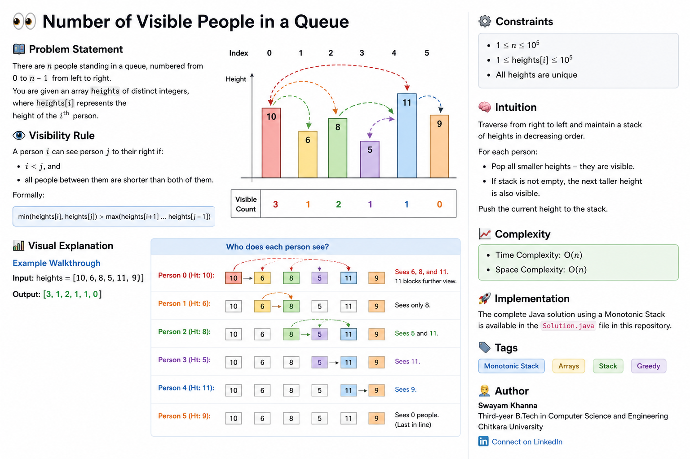

# 👀 Number of Visible People in a Queue

## 📊 Visual Explanation



---

## 🧩 Problem Statement

There are **n people** standing in a queue, numbered from `0` to `n - 1` from left to right.

You are given an array `heights` of **distinct integers**, where:

* `heights[i]` represents the height of the *i-th* person.

---

## 👁️ Visibility Rule

A person `i` can see person `j` to their right if:

* `i < j`, and
* all people between them are **shorter than both**

### 📌 Formally:

```
min(heights[i], heights[j]) > max(heights[i+1] ... heights[j-1])
```

---

## 📊 Example Walkthrough

### Input:

```
heights = [10, 6, 8, 5, 11, 9]
```

### Output:

```
[3, 1, 2, 1, 1, 0]
```

---

### 🔍 Explanation:

* **Person 0 (10)** → sees `6, 8, 11`
  → `11` blocks further view

* **Person 1 (6)** → sees `8`

* **Person 2 (8)** → sees `5, 11`

* **Person 3 (5)** → sees `11`

* **Person 4 (11)** → sees `9`

* **Person 5 (9)** → sees `0` people

---

## ⚙️ Constraints

* `1 ≤ n ≤ 10^5`
* `1 ≤ heights[i] ≤ 10^5`
* All heights are **unique**

---

## 🧠 Intuition

This problem is solved using a **Monotonic Stack**:

* Traverse from **right to left**
* Maintain a stack of **heights in decreasing order**
* For each person:

  * Pop all smaller elements → they are visible
  * If stack still has an element → first taller person is also visible

---

## ⏱️ Complexity

* **Time Complexity:** `O(n)`
* **Space Complexity:** `O(n)`

---

## 🚀 Implementation

The complete Java solution using a Monotonic Stack is included in this repository.

---

## 📌 Tags

`Monotonic Stack` · `Arrays` · `Stack` · `Greedy`

---

## ✍️ Author

**Swayam Khanna**
B.Tech (CSE), 3rd Year
Chitkara University
